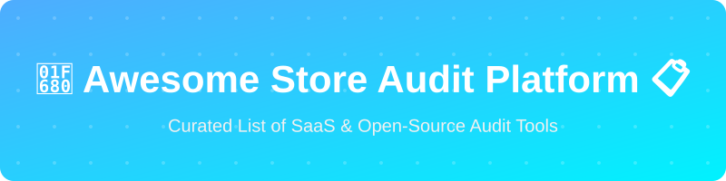

# 🚀 Awesome Store Audit Platform

  

  
  
  

## Top Store Audit Platforms Ecosystem

**Curated List of SaaS Products & Open-Source GitHub Projects**  

*Focused on Retail Store Audits, Field Inspections, Merchandising Checks, Checklists & Operational Compliance*  

**Last updated: August 2026**

This repository tracks notable **SaaS platforms** and **open-source projects** for **Store Audit** solutions. These tools enable retailers, CPG brands, and multi-location operators to digitize store visits, run mobile checklists and inspections, capture photos and evidence, score compliance, assign corrective actions, and gain real-time visibility into in-store execution and operational standards.

**Examples** include SafetyCulture (iAuditor), GoSpotCheck (FORM MarketX), Repsly, FORM MarketX, MeazureUp, Zenput, AuditPro, GoAudits, FlowPath Audits, and iAuditor (the category leaders).

**Open-source emphasis**: This section is heavily expanded with every major active project for self-hosting, digital checklists, inspection forms, field data capture, and open audit/compliance tooling — ideal for retailers, operations teams, and developers building transparent, customizable store audit systems.

Contributions welcome! Open a PR to add/update entries. Keep descriptions factual and link to official sites.

## 📚 Table of Contents

- [SaaS/Hosted Platforms](#saas-hosted-platforms)

- [Open-Source GitHub Projects](#open-source-github-projects)

- [How to Contribute](#how-to-contribute)

- [Disclaimer](#disclaimer)

## 🏢 SaaS/Hosted Platforms

| Product | Description | Pricing | Free Tier Limit | Company Size |
| :--- | :--- | :--- | :--- | :--- |
| **[SafetyCulture (iAuditor)](https://safetyculture.com/)** | Leading mobile-first inspection and audit platform with digital checklists, photo evidence, issue tracking, corrective actions, and templates used widely across retail and other industries. | ~$24/user/mo | Up to 10 users, 5 active templates | $2.7B Valuation |
| **[GoSpotCheck / FORM MarketX](https://www.form.com/)** | Field execution and retail audit platform (formerly GoSpotCheck) focused on missions, structured tasks, photo capture, and analytics for CPG and retail field teams. | ~$35-40/user/mo | N/A | ~$100M Revenue |
| **[Zenput](https://www.zenput.com/)** | Multi-location operations platform that helps enforce standards through digital checklists, audits, task management, and real-time visibility across stores. | Custom | N/A | ~$50M Revenue |
| **[Repsly](https://www.repsly.com/)** | Retail execution management platform for store visits, customizable audit forms, merchandising checks, photo documentation, route planning, and rep performance tracking. | Custom (~$29/user/mo) | N/A | ~$20M Revenue |
| **[MeazureUp](https://www.meazureup.com/)** | Store audit and retail execution solution focused on compliance scoring, photo audits, and operational insights for multi-location businesses. | Custom | N/A | ~$15M Revenue |
| **[FlowPath Audits](https://www.flowpath.com/)** | Operations and audit platform that combines inspections, work orders, and facility/store compliance management. | Custom flat rate | N/A | ~$10M Revenue |
| **[GoAudits](https://www.goaudits.com/)** | Mobile audit and inspection app designed for fast field checks, offline capability, scored audits, photo evidence, and corrective action workflows. | From ~$14/user/mo | N/A (14-day free trial) | ~$5M Revenue |
| **[AuditPro](https://www.auditpro.com/)** | Audit and inspection software supporting structured store and operational audits with reporting and compliance tracking. | ~$60/year or Custom | N/A | ~$5M Revenue |

## 🌍 Open-Source GitHub Projects

- **[nocodb](https://github.com/nocodb/nocodb)**   
  Open Source Airtable Alternative, great for building audit databases and tracking.

- **[twenty](https://github.com/twentyhq/twenty)**   
  Open-Source CRM which can be adapted for store management and audits.

- **[appsmith](https://github.com/appsmithorg/appsmith)**   
  Open-source low-code platform ideal for creating custom store audit dashboards, form-based inspections, and operational reporting tools.

- **[erpnext](https://github.com/frappe/erpnext)**   
  Full open-source ERP with maintenance, support, inventory, and customizable forms.

- **[budibase](https://github.com/Budibase/budibase)**   
  Open-source low-code platform for building internal tools, digital checklists, inspection forms, and custom audit applications quickly.

- **[formbricks](https://github.com/formbricks/formbricks)**   
  Open-source survey and form platforms that can power digital checklists, feedback, and structured audit data collection.

- **[field-service](https://github.com/OCA/field-service)**   
  Open-source ERP modules providing field service orders, routes, checklists, and operational workflows.

- **[kpi](https://github.com/kobotoolbox/kpi)**   
  Field data collection tool suitable for mobile store audits.

- **[CIS-Audit-Tool](https://github.com/SiteQ8/CIS-Audit-Tool)**   
  Interactive checklist and progress-tracking tools that demonstrate patterns for building scored audit systems.

- **[OpenInspection](https://github.com/InspectorHub/OpenInspection)**   
  Open-source inspection software with mobile field forms, professional reports, e-signatures, offline PWA support, and self-hosting options.

- **[auditree](https://github.com/ComplianceAsCode/auditree)**   
  Evidence collection and verification framework that can support continuous audit evidence lockers.

### 🔧 Additional Strong Open-Source Options

- **Odoo / ERPNext custom modules** for retail-specific audit templates and scoring.

- **Low-code platforms** (Budibase, Appsmith, Tooljet) for rapid custom store-visit and checklist apps.

- **Mobile form + PWA** stacks (React Native, Capacitor, offline-first forms) combined with photo upload and GPS.

- **CMMS and facility tools** (openMAINT, community maintenance systems) adapted for store compliance.

- Many community **digital checklist**, **inspection report**, and **field data capture** projects on GitHub.

**Frameworks for building custom systems**: Combine a **low-code form builder** (Budibase/Appsmith) or **Odoo/ERPNext** for structured checklists and workflows, mobile/PWA frontends for offline photo and GPS capture, and open reporting dashboards for a complete self-hosted store audit platform.

## 🤝 How to Contribute

1. Fork the repo.

2. Add/edit entries in `README.md` (follow existing format).

3. Include: name, link, 1–2 sentence description, and whether it's SaaS or open-source.

4. Submit PR with a short explanation.

Star the repo if you find it useful!

## ⚠️ Disclaimer

- This is a **community-curated** list — not exhaustive and not an endorsement.

- Store audit and inspection tools must respect privacy, labor, and data-protection regulations when capturing employee or customer-related information.

- Self-hosted open-source solutions require proper mobile security, offline data handling, and operational reliability.

---

**Made for retail operations leaders, CPG field teams, multi-unit managers, and compliance practitioners.**  

Let's make store audits more consistent, data-driven, and accessible.

## 📈 Star History

<a href="https://www.star-history.com/?repos=ishandutta2007/Awesome-Store-Audit-Platform&type=date&legend=bottom-right">
<picture>
<source media="(prefers-color-scheme: dark)" srcset="https://api.star-history.com/chart?repos=ishandutta2007/Awesome-Store-Audit-Platform&type=date&theme=dark&legend=bottom-right" />
<source media="(prefers-color-scheme: light)" srcset="https://api.star-history.com/chart?repos=ishandutta2007/Awesome-Store-Audit-Platform&type=date&legend=bottom-right" />

</picture>
</a>

